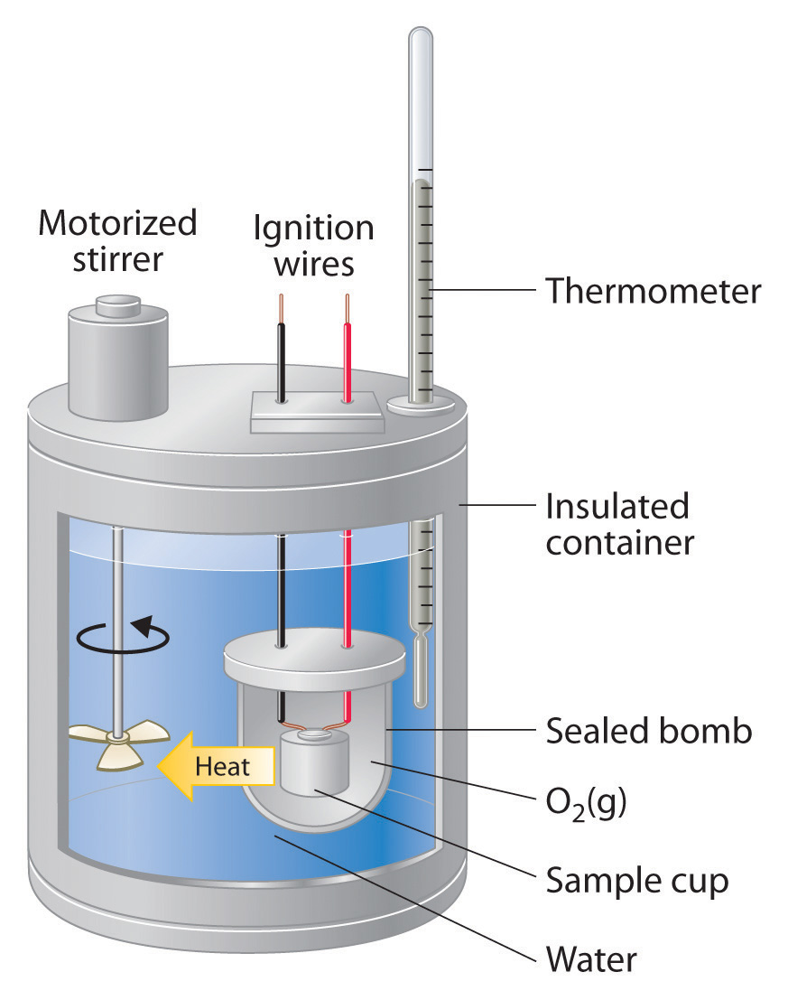
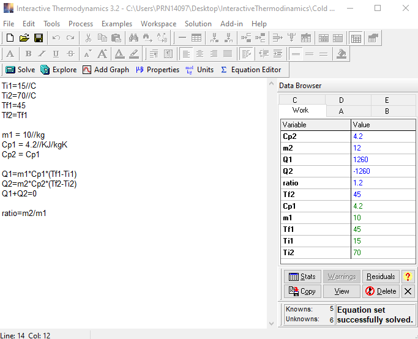

 

	
	<h3 align="center">Wiley's Interactive Thermodynamics</h3>
	

    	Scripts used to solve for thermodynamic equations
  	

## Installation

1. Download and install [IT: Interactive Thermodynamics](https://bcs.wiley.com/he-bcs/Books?action=resource&bcsId=8892&itemId=1118412931&resourceId=36232) from Wiley site.
2. Open `it3` files, edit their variable values and solve for various thermodynamic equations (includes chemical properties database).
1. To learn more about pure fluid properties you can also download [NIST miniREFPROP](https://trc.nist.gov/refprop/MINIREF/MINIREF.HTM) as reference.

 

 
 E.g Calorimetry and heat capacity equation solver 
  

## License

Distributed under the [MIT License](https://mit-license.org/).

## Contact

Dario Arzaba - dario.arzaba@gmail.com